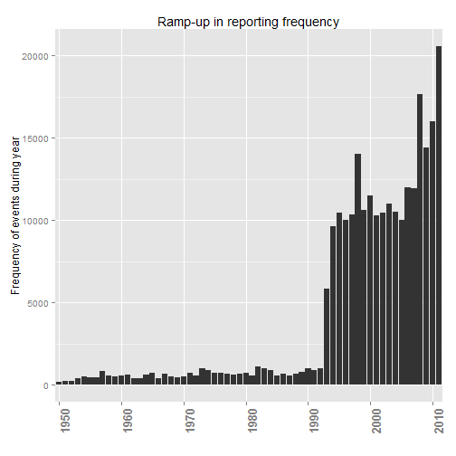
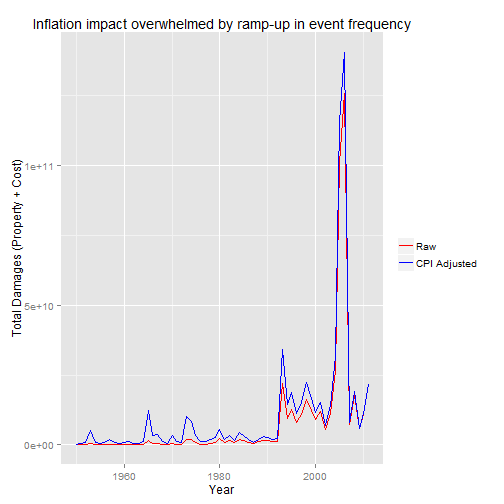
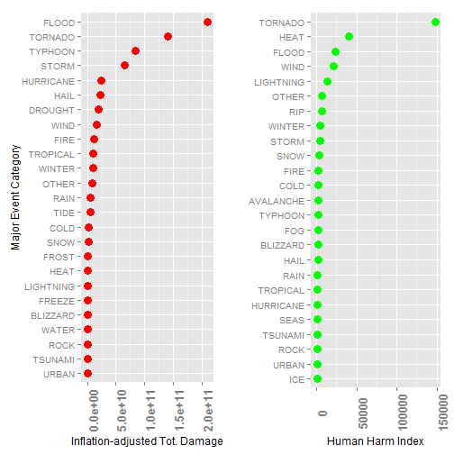

## Synopsis
This analysis aims to answer two questions:

1. Across the US, which events are most harmful with respect to population health?
2. Across the US, which events have the greatest economic consequences?

To score (index) human harm, I counted a single fatality equal to 10 injuries; to score economic consequencies, I added property damage to crop damage (and inflation-adjusted all damages to 2011 as the base, based on annual US CPI).

The Major Events with **greatest economic consequences** are: Flood, Tornado, Typhoon, Storm, Hurricane, Hail, Drought, Wind, Fire, Tropical, and Winter. The Major Events which are **most harmful to human health** are: Tornado, Heat, Flood, Wind, and Lightning.

## Data Processing
### Data Processing: Original data
The original datafile is very large so I wrote a dataframe that includes all rows but only selected columns (please note I did read from the original .bz2 file and my smaller file is available!).

```r
Sys.setlocale("LC_ALL","English")
stormDataRaw <- read.csv("repdata_data_StormData.csv.bz2")
stormData <- stormDataRaw[, c("BGN_DATE", "BGN_TIME", "TIME_ZONE" , "COUNTY" , 
                            "COUNTYNAME" , "STATE", "EVTYPE", "FATALITIES", 
                            "INJURIES", "PROPDMG", "PROPDMGEXP", "CROPDMG", 
                            "CROPDMGEXP", "WFO" , "STATEOFFIC", "ZONENAMES", 
                            "LATITUDE", "LONGITUDE", "REFNUM")]
write.csv(stormData, "stormData.csv")
```

### Data Processing: Load data
Libraries are loaded; sdata$YEAR_N is created to hold the year (1950, 1960, ...). Please note that file "stormData.csv" is available on the github repo and is merely a (column-) subset of the original raw datafile.

```r
# getting the smaller file, which is only ~ 165 MB compared to 549 MB for the original, unpacked
library(lubridate)
library(ggplot2)
library(grid)
library(gridExtra)
sdata <- read.csv("stormData.csv", stringsAsFactors = FALSE)
sdata$YEAR <- strptime(sdata$BGN_DATE, format = "%m/%d/%Y")
sdata$YEAR_N <- year(sdata$YEAR)
```

### Data Processing: Decisions: Map to Major Events, Damage exponents, Inflation-adjust
The first data problem is that the event vector, EVTYPE, contains about 985 unique values. I first eliminated all events without any consequence, but still 488 unique event types remained! Several approaches are possible. I decided to reference on the Storm Data Event Table (Table 2.1.1. of NWSI 10-1605). This lists only 48 events; consequently, I sought to define what I call "Major Events." For example, "FLOOD" is a major event type which includes (i.e., is mapped to) several specific events which include this keyword. The majority of the mapping is achieved by keyword. However, I iterated additional mappings until I had include ALMOST ALL of the specific events; for example, the major event "SEAS" contains many different specific events. The method, while tedious, successfully maps all 488 unique, specific events to only 43 Major Events (albeit several are assigned to "Other").

The second processing step is to adjust the damage values to account for the effectively scientific notation. I give credit to Detlev Figgen on the forum, [see here](https://class.coursera.org/repdata-007/forum/thread?thread_id=65#post-410), for help understanding this. 

My third processing step was to inflation-adjust the damage values. I retrieved annual CPI values and indexed them such that a CPI-based multiplier is applied to damage values based on the year of the damage. For example, the multiplier for damage in 2011 is 1.0 because it is the most recent year. The multipler for damage in 1980 is ~2.61 because that is the chained multiplier that would inflation adjust the damage to 2011 (the base in the analysis, for an apples-to-apples comparison). The CPI values were retrieved from [quandl.com](http://www.quandl.com/) but the processed file is on the github repository.

```r
# Only need the events that produced human harm or economic damage
# This reduces from 902,297 rows to 254,633 rows
sdata.e <- sdata[(sdata$FATALITIES > 0) | (sdata$INJURIES > 0) | 
                     (sdata$PROPDMG > 0) | (sdata$CROPDMG >0 ), ]

# Mapping event types to "Major Events" 
# EV_MAJOR has 43 Factor levels; i.e., 43 major events
sdata.e$EVTYPE <- toupper(sdata.e$EVTYPE)
sdata.e$EV_MAJOR <- NULL
s.char <- c("ASTRONOMICAL", "AVALANCHE", "BLIZZARD", "BURST", "COLD", "DRIZZLE", "DROUGHT", 
            "DUST", "EROSION", "EXPOSURE", "FIRE", "FLOOD", "FOG", "FREEZE", "FROST", "GLAZE",
            "HAIL", "HEAT", "HURRICANE", "ICE", "LANDSLIDE", "LIGHTNING", "MIX", "MUD", "OTHER",
            "RAIN", "RIP", "ROCK", "SHOWER", "SLEET", "SMOKE", "SNOW", "STORM", "SURF", "TIDE",
            "TORNADO", "TROPICAL", "TSUNAMI", "TYPHOON", "SEAS", "URBAN",  "VOLCANIC", "WATER",
            "WIND", "WINTER")

for (x in s.char) {
    sdata.e$EV_MAJOR[grepl(x,sdata.e$EVTYPE)] <- x
} 

sdata.e$EV_MAJOR[grepl("ICY ROADS",sdata.e$EVTYPE)] <- "ICE"
sdata.e$EV_MAJOR[grepl("HEAVY SWELLS|HIGH SWELLS|ROGUE WAVE|SEICHE|HIGH WAVES|COASTAL SURGE|MARINE MISHAP|MARINE ACCIDENT",sdata.e$EVTYPE)] <- "SEAS"
sdata.e$EV_MAJOR[grepl("FREEZING SPRAY",sdata.e$EVTYPE)] <- "FREEZE"
sdata.e$EV_MAJOR[grepl("WARM WEATHER",sdata.e$EVTYPE)] <- "HEAT"
sdata.e$EV_MAJOR[grepl("FUNNEL CLOUD|GUSTNADO|TORNDAO",sdata.e$EVTYPE)] <- "TORNADO"
sdata.e$EV_MAJOR[grepl("WET|DROWNING|DAM BREAK",sdata.e$EVTYPE)] <- "WATER"
sdata.e$EV_MAJOR[grepl("LOW TEMPERATURE",sdata.e$EVTYPE)] <- "COLD"
sdata.e$EV_MAJOR[grepl("LAND",sdata.e$EVTYPE)] <- "ROCK"
sdata.e$EV_MAJOR[grepl("HEAVY PRECIPITATION",sdata.e$EVTYPE)] <- "RAIN"
sdata.e$EV_MAJOR[grepl("AVALANCE",sdata.e$EVTYPE)] <- "AVALANCHE"
sdata.e$EV_MAJOR[grepl("LIGNTNING|LIGHTING",sdata.e$EVTYPE)] <- "LIGHTNING"
sdata.e$EV_MAJOR[grepl("TSTMW|HIGH|APACHE COUNTY|SEVERE TURBULENCE",sdata.e$EVTYPE)] <- "OTHER"
sdata.e$EV_MAJOR[is.na(sdata.e$EV_MAJOR)] <- "OTHER"

sdata.e$EV_MAJOR <- as.factor(sdata.e$EV_MAJOR)

# creating accurate exponent for damage values
sdata.e$PROPDMGEXP_N <- NULL
sdata.e$CROPDMGEXP_N <- NULL
suppressWarnings(sdata.e$PROPDMGEXP_N <- as.numeric(sdata.e$PROPDMGEXP))
suppressWarnings(sdata.e$CROPDMGEXP_N <- as.numeric(sdata.e$CROPDMGEXP))
sdata.e$PROPDMGEXP_N[sdata.e$PROPDMGEXP == "H" | sdata.e$PROPDMGEXP == "h"] <- 10^2
sdata.e$PROPDMGEXP_N[sdata.e$PROPDMGEXP == "3" | sdata.e$PROPDMGEXP == "K" | sdata.e$PROPDMGEXP == "k"] <- 10^3
sdata.e$PROPDMGEXP_N[sdata.e$PROPDMGEXP == "M" | sdata.e$PROPDMGEXP == "M"] <- 10^6
sdata.e$PROPDMGEXP_N[sdata.e$PROPDMGEXP == "B" | sdata.e$PROPDMGEXP == "b"] <- 10^9
sdata.e$PROPDMGEXP_N[sdata.e$PROPDMGEXP == "-" | sdata.e$PROPDMGEXP == "+" |sdata.e$PROPDMGEXP == "0"] <- 1
sdata.e$PROPDMGEXP_N[is.na(sdata.e$PROPDMGEXP_N)] <- 1

sdata.e$CROPDMGEXP_N[sdata.e$CROPDMGEXP == "k" | sdata.e$CROPDMGEXP == "K"] <- 10^3
sdata.e$CROPDMGEXP_N[sdata.e$CROPDMGEXP == "m" | sdata.e$CROPDMGEXP == "M"] <- 10^6
sdata.e$CROPDMGEXP_N[sdata.e$CROPDMGEXP == "B" ] <- 10^9
sdata.e$CROPDMGEXP_N[sdata.e$CROPDMGEXP == "0" ] <- 1
sdata.e$CROPDMGEXP_N[is.na(sdata.e$CROPDMGEXP_N)] <- 1

# library(Quandl)
# Quandl.auth("G5xW3q6kgbALQ8L2srWD")
# inflation <- Quandl("SGE/USACPIC", collapse="annual")
# write.csv(inflation, "inflation.csv")
cpi_index <- read.csv("cpiindex.csv")
sdata.i <- merge(sdata.e, cpi_index, by.x = "YEAR_N", by.y = "year", all.x = TRUE)

# inflated damagaes
sdata.i$PDAMAGE <- NULL
sdata.i$CDAMAGE <- NULL
sdata.i$PDAMAGE <- sdata.i$PROPDMG * sdata.i$PROPDMGEXP_N
sdata.i$CDAMAGE <- sdata.i$CROPDMG * sdata.i$CROPDMGEXP_N
sdata.i$PDAMAGE.i <- sdata.i$PROPDMG * sdata.i$PROPDMGEXP_N * sdata.i$index
sdata.i$CDAMAGE.i <- sdata.i$CROPDMG * sdata.i$CROPDMGEXP_N * sdata.i$index
```


## Results
### Results: Only 19 years dominate the sample
Although the sample technically extends back to 1950, the results are largely informed the period 1993 to 2011.

```r
series.freq <- table(sdata.i$YEAR_N)
series.freq.df <- data.frame(series.freq)
labels <- seq(1950, 2011, by=10)
ggplot(series.freq.df, aes(x=Var1, y=Freq)) + 
    geom_bar(stat="identity") +
    ylab("Frequency of events during year") +
    xlab("") +
    scale_x_discrete(breaks=labels, labels=as.character(labels)) +
    theme(axis.text.x = element_text(angle=90, size=rel(1.4), face="bold")) +
    ggtitle ("Ramp-up in reporting frequency")
```

 

### Results: Consequently, inflation does not dramatically alter the results
Per dollar of damage, inflation has a big impact; for example, dollar damage in 1970 is multipied by fully 5.67. However, this large dollar impact is overwhelmed by the lower frequencies, in general. 

```r
# harmful user-defined statistics
sdata.i$health <- sdata.i$INJURIES + (sdata.i$FATALITIES * 10)
sdata.i$economics <- sdata.i$PDAMAGE + sdata.i$CDAMAGE
sdata.i$economics.i <- sdata.i$PDAMAGE.i + sdata.i$CDAMAGE.i

# inflation
economic.by.year <- aggregate(sdata.i["economics"], by=sdata.i["YEAR_N"], FUN="sum", na.rm = TRUE)
economic.by.year.1 <- aggregate(sdata.i["economics.i"], by=sdata.i["YEAR_N"], FUN="sum", na.rm = TRUE)
df.economic <- data.frame(economic.by.year, economic.by.year.1)
colnames(df.economic) <- c("Year", "Raw.damage", "Year.1", "Inflation.adjusted")

# write.csv(df.economic, "comparison_inf.csv") # for excel examination
ggplot(df.economic, aes(x = Year)) +
    geom_line(aes(y = Raw.damage, color="Raw")) +
    geom_line(aes(y = Inflation.adjusted, color="CPI Adjusted")) +
    scale_color_manual("",
                        breaks = c("Raw", "CPI Adjusted"),
                        values = c("blue", "red")) +
    ylab("Total Damages (Property + Cost)") +
    xlab("Year") +
    ggtitle ("Inflation impact overwhelmed by ramp-up in event frequency")
```

 


### Results: Major events with greatest impact
In order to rank impact on a single index, while several approaches are possible, I decided:

* Economic consequence = Property Damage (PROPDMG) + Crop Damage (CROPDMG), inflation-adjusted
* Harm to Human health = Injuries + (fatalities * 10)

As charted below, my conclusion are:

* The Major Events with __greatest economic consequences__ are: Flood, Tornado, Typhoon, Storm, Hurricane, Hail, Drought, Wind, Fire, Tropical, and Winter.
* The Major Events which are __most harmful to human health__ are: Tornado, Heat, Flood, Wind, and Lightning.


```r
# aggregate
economic.bymajor <- aggregate(sdata.i["economics.i"], by=sdata.i["EV_MAJOR"], FUN="sum", na.rm = TRUE)
economic.bymajorL <- economic.bymajor[economic.bymajor$economics > 90000000,]
health.bymajor <- aggregate(sdata.i["health"], by=sdata.i["EV_MAJOR"], FUN="sum", na.rm = TRUE)
health.bymajorL <- health.bymajor[health.bymajor$health > 300,]

# plot
plot1 <- ggplot(economic.bymajorL, aes(x = economics.i, y = reorder(EV_MAJOR, economics.i))) +
    geom_point(size=4, color="red") +
    ylab("Major Event Category") +
    xlab("Inflation-adjusted Tot. Damage") +
    theme(axis.text.x = element_text(angle=90, size=rel(1.4), face="bold"))
plot2 <- ggplot(health.bymajorL, aes(x = health, y = reorder(EV_MAJOR, health))) + 
    ylab("") +
    xlab("Human Harm Index") +
    geom_point(size=4, color="green") +
    theme(axis.text.x = element_text(angle=90, size=rel(1.4), face="bold"))
grid.arrange(plot1, plot2, ncol=2)
```

 

